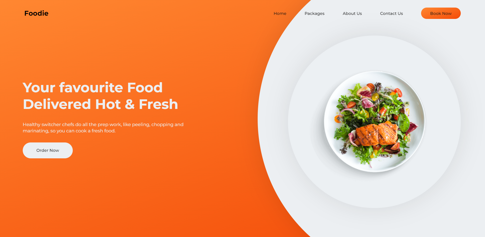

  

<h1 align= "center">Foodie</h1>

Animated Landing Page

## Features
 
Following are some of the new features and learning encountered while creating this amazing project:

- The appearance effect is applied using the CSS animation without any external library
- The plate at the right keeps revolving after the page has loaded.
  

## Resources
 
Follwing resources have been used in maing this project:

- [Google Fonts](https://fonts.google.com/) to import the **Montserrat Family** of fonts. 
  

## GUI

  

## Technology Stack
 
Follwing technologies have been used at the core of this application to make it stand in the market place:

- HTML
- CSS
- Animation (CSS Property) 
  

## Developer
Muhammad Abdullah Butt  
abdullahbutt12292210@gmail.com  
> [Instagram](https://www.instagram.com/abdullah.butt.22/) 
> [FaceBook](https://www.facebook.com/profile.php?id=100076291614529) 
> [YouTube](https://www.youtube.com/channel/UCnuOFQyMywg-KuoN-lmav1Q) 
> [Portfolio](https://rebrand.ly/muhammadabdullahPortfolio) 
> [Website](#)

