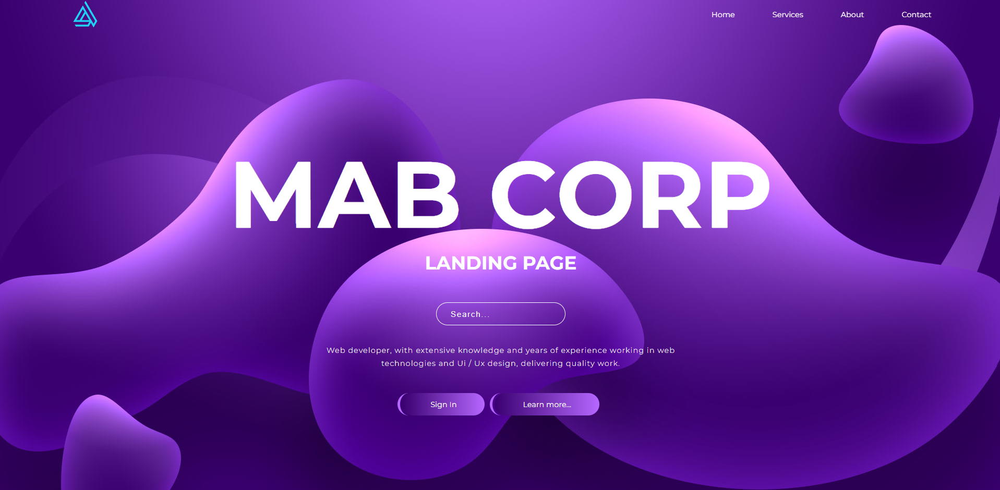

<h1 align = "center">Liquid Background</h1>

Responsive Landing Page HTML CSS

## Resources
 
Follwing resources have been used in maing this project:
  
- [Google Fonts](https://fonts.google.com/specimen/Montserrat?query=mont) is used to import the **Montserrat Font Family**
- [BoxIcons](https://boxicons.com/?query=menu) to import different icons to be used in this website
  
  
## GUI

  

## Technology Stack
 
Follwing technologies have been used at the core of this application to make it stand in the market place:
  
- HTML
- CSS
  

## Advancement
> No Advancement Required.
  

## Developer
Muhammad Abdullah Butt  
abdullahbutt12292210@gmail.com  
> [Instagram](https://www.instagram.com/abdullah.butt.22/) 
> [FaceBook](https://www.facebook.com/profile.php?id=100076291614529) 
> [YouTube](https://www.youtube.com/channel/UCnuOFQyMywg-KuoN-lmav1Q) 
> [Portfolio](https://rebrand.ly/muhammadabdullahPortfolio) 
> [Website](#)
